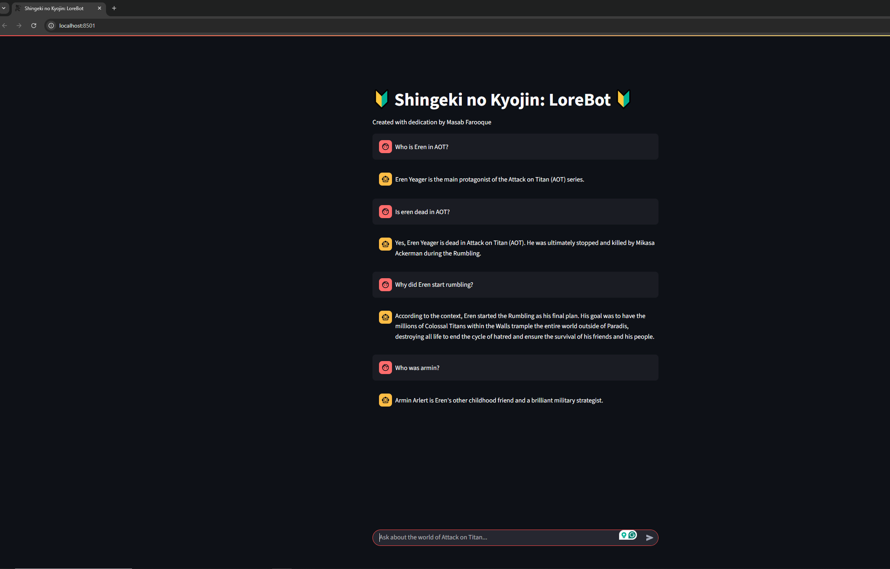

# Shingeki no Kyojin: LoreBot

Welcome to the **Attack on Titan LoreBot**! This project is a fun, interactive chatbot that answers questions about the world of Attack on Titan using AI and a custom knowledge base.

---

## 🌟 What is LoreBot?
LoreBot is your friendly companion for exploring the deep lore of Attack on Titan. Ask it anything about Titans, the Walls, characters, or major events, and it will answer using facts from the series. It uses the Groq API and LangChain for fast, smart responses.

---

## 🚀 Features
- **Chat about AoT lore**: Ask questions and get detailed, accurate answers.
- **Beautiful UI**: Styled with custom CSS and background art for an immersive experience.
- **Powered by Groq & LangChain**: Fast, modern AI tech under the hood.
- **All data is local**: No spoilers or random internet info—just the curated knowledge base.

---

## �️ Screenshot


---

## �🛠️ How to Run
1. **Clone the repo**
   ```bash
   git clone https://github.com/Masab12/aot-lore-bot.git
   cd aot-lore-bot
   ```
2. **Install requirements**
   ```bash
   pip install -r requirements.txt
   ```
3. **Set your Groq API key**
   - Get a free API key from [Groq Console](https://console.groq.com/).
   - Set it in your environment:
     - On Windows (PowerShell):
       ```powershell
       $env:GROQ_API_KEY="your_key_here"
       ```
     - On Mac/Linux:
       ```bash
       export GROQ_API_KEY="your_key_here"
       ```
4. **Run the app**
   ```bash
   streamlit run app.py
   ```

---

## 📁 Project Structure
```
app.py                # Main entry point
requirements.txt      # Python dependencies
assets/               # Images and CSS
core/
  aot_rag_brain.py    # The AI brain (RAG chain)
  app.py              # Streamlit UI
knowledge_base/
  aot_lore.txt        # All the lore facts
```

---

## 👤 Author
Made with dedication by **Masab Farooque**

---

## ❤️ Credits
- [Attack on Titan](https://en.wikipedia.org/wiki/Attack_on_Titan) by Hajime Isayama
- [LangChain](https://github.com/langchain-ai/langchain)
- [Groq](https://console.groq.com/)
- [Streamlit](https://streamlit.io/)

---

Enjoy exploring the world of Titans! Dedicate your hearts! 💚
